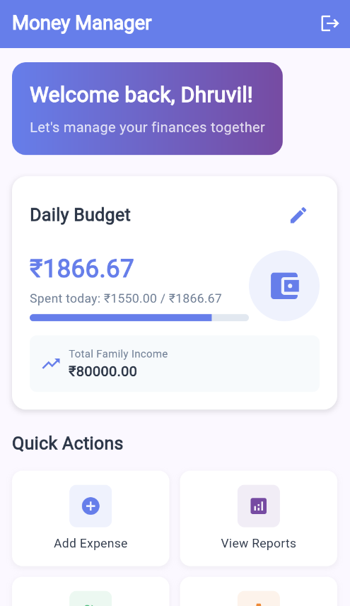

# 💰 Money Manager

A comprehensive Flutter application for personal finance management with secure authentication, modern UI, and intelligent expense tracking by person. Perfect for individuals, couples, and families to manage their finances effectively.



## 🌟 Key Features

### 🔐 **Advanced Authentication System**
- **Secure Login**: Email and password authentication with comprehensive validation
- **Smart Registration**: Multi-step onboarding with tracking preference selection
- **Persistent Sessions**: Login state maintained across app restarts using secure storage
- **Profile Management**: Complete profile editing with family and dependency management
- **Demo Account**: Pre-configured account for instant testing

### 💡 **Intelligent Tracking Preferences**
- **Individual Tracking**: Personal expense management for single users
- **Couple Tracking**: Joint expense tracking for partners
- **Family Tracking**: Complete family expense management with dependents
- **Smart Onboarding**: Conditional fields based on tracking preference
- **Dynamic UI**: Interface adapts to user's chosen tracking method

### 💰 **Comprehensive Financial Dashboard**
- **Real-time Analytics**: Live balance, income, expenses, and savings tracking
- **Budget Management**: Smart budget preferences (Daily/Monthly/Quarterly/Individual)
- **Quick Actions**: One-tap access to add expenses, view reports, and settings
- **Recent Transactions**: Detailed transaction history with categorization
- **Modern Design**: Beautiful gradient UI with card-based layout

### 👥 **Person-Based Expense Tracking**
- **Smart Attribution**: Track expenses by person (individual, couple, or family)
- **Conditional Dropdowns**: Person selection only appears when relevant
- **Family Analytics**: Pie charts showing spending distribution by person
- **Detailed Reports**: Person-specific expense lists and analytics
- **No Duplicates**: Automatic duplicate prevention in person lists

### 📊 **Advanced Analytics & Reports**
- **Category Pie Charts**: Visual spending breakdown by expense categories
- **Person Pie Charts**: Spending distribution by family members (family/couple only)
- **Dual Filtering**: Filter by both category and person simultaneously
- **Real-time Updates**: Instant analytics updates when filters change
- **Export Ready**: Structured data for future export features

### 🛡️ **Enterprise-Grade Security**
- **Secure Storage**: Flutter Secure Storage for sensitive data
- **Form Validation**: Comprehensive input validation with user-friendly messages
- **Session Management**: Automatic session refresh and secure logout
- **Data Integrity**: Corrupted data detection and automatic cleanup
- **Privacy First**: All data stored locally with encryption

## 🚀 Quick Start

### Prerequisites
- **Flutter SDK**: 3.7.0 or higher
- **Dart SDK**: Included with Flutter
- **Development Environment**: Android Studio, VS Code, or IntelliJ IDEA
- **Device**: Android Emulator or Physical Device

### Installation

1. **Clone the repository**
   ```bash
   git clone <repository-url>
   cd money_manager
   ```

2. **Install dependencies**
   ```bash
   flutter pub get
   ```

3. **Run the application**
   ```bash
   flutter run
   ```

## 📱 Demo Account

For instant testing, use the pre-configured demo account:
- **Email**: `demo@example.com`
- **Password**: `password123`

## 🏗️ Project Architecture

### **Clean Architecture Structure**
```
lib/
├── main.dart                    # App entry point with theme configuration
├── models/                      # Data models
│   ├── user.dart               # User, FamilyMember, Dependency models
│   └── expense.dart            # Expense model with person tracking
├── providers/                   # State management
│   ├── auth_provider.dart      # Authentication state & user management
│   ├── expense_provider.dart   # Expense & budget management
│   └── group_provider.dart     # Group management (future feature)
├── screens/                     # UI screens
│   ├── login_screen.dart       # Secure login with validation
│   ├── signup_screen.dart      # Multi-step registration
│   ├── dashboard_screen.dart   # Main dashboard with analytics
│   ├── expenses_screen.dart    # Add/edit expenses with person tracking
│   ├── tracker_screen.dart     # Advanced reports & analytics
│   ├── groups_screen.dart      # Group management
│   ├── settings_screen.dart    # Settings & profile access
│   └── account_screen.dart     # Profile editing & family management
├── services/                    # Business logic
│   ├── auth_service.dart       # Authentication & user persistence
│   └── storage_service.dart    # Local data storage management
└── utils/                       # Utilities & constants
    ├── app_constants.dart      # App-wide constants & styling
    ├── date_utils.dart         # Date formatting utilities
    └── validation_utils.dart   # Form validation utilities
```

## 🛠️ Technology Stack

### **Core Dependencies**
- **Flutter**: Cross-platform mobile development
- **Provider**: State management and dependency injection
- **SharedPreferences**: Local data persistence
- **Flutter Secure Storage**: Encrypted sensitive data storage
- **Form Validator**: Comprehensive form validation
- **HTTP**: Future API integration ready
- **Intl**: Internationalization and date formatting

### **Architecture Patterns**
- **Provider Pattern**: State management and data flow
- **Repository Pattern**: Data access abstraction
- **Service Layer**: Business logic separation
- **Model-View-Controller**: Clean separation of concerns

## 📋 Feature Details

### **🔐 Authentication Flow**
1. **Login Screen**
   - Email and password validation
   - Password visibility toggle
   - Loading states and error handling
   - Demo account information
   - Link to registration

2. **Registration Flow**
   - **Step 1**: Basic information (name, email, password, phone)
   - **Step 2**: Tracking preference selection (Individual/Couple/Family)
   - **Step 3**: Conditional details based on preference
   - **Step 4**: Dependencies (Family only)
   - **Step 5**: Budget preferences

3. **Profile Management**
   - Update personal information
   - Manage family members and relationships
   - Handle dependencies and special needs
   - Modify budget preferences
   - Real-time validation and updates

### **💰 Expense Management**
1. **Smart Expense Entry**
   - Category-based organization
   - Person attribution (when applicable)
   - Amount validation and formatting
   - Description and notes
   - Date tracking

2. **Conditional Person Selection**
   - **Individual**: No person dropdown (auto-attributed)
   - **Couple**: User + partner selection
   - **Family**: User + family members + dependents
   - **No Duplicates**: Automatic duplicate prevention

3. **Transaction Management**
   - Add income and expenses
   - Edit existing transactions
   - Delete with confirmation
   - Real-time balance updates

### **📊 Analytics & Reporting**
1. **Category Analytics**
   - Pie chart visualization
   - Category breakdown lists
   - Filtered expense views
   - Spending trends

2. **Person Analytics** (Family/Couple only)
   - Person-based pie charts
   - Individual spending analysis
   - Family member comparisons
   - Dependency spending tracking

3. **Dual Filtering System**
   - Category filter dropdown
   - Person filter dropdown
   - Combined filtering capabilities
   - Real-time analytics updates

### **🎨 User Experience**
1. **Responsive Design**
   - Adaptive layouts for all screen sizes
   - Vertical dropdown layout (prevents overflow)
   - Touch-friendly interface
   - Professional styling

2. **Smart Interface**
   - Conditional UI elements
   - Progressive disclosure
   - Context-aware features
   - Intuitive navigation

3. **Performance Optimization**
   - Efficient state management
   - Optimized rendering
   - Smooth animations
   - Fast data loading

## 🔧 Configuration

### **Environment Setup**
```yaml
environment:
  sdk: ^3.7.0
```

### **Key Dependencies**
```yaml
dependencies:
  flutter: sdk: flutter
  provider: ^6.1.1
  shared_preferences: ^2.2.2
  flutter_secure_storage: ^9.0.0
  form_validator: ^2.1.1
  http: ^1.1.0
  intl: ^0.19.0
```

## 📱 Screen Overview

### **🏠 Dashboard Screen**
- Welcome section with user profile
- Financial overview cards (Balance, Income, Expenses, Savings)
- Budget section with preference-based calculations
- Quick action buttons for common tasks
- Recent transactions list
- Logout functionality

### **💸 Expenses Screen**
- Add/edit expense and income transactions
- Smart person selection (conditional)
- Category-based organization
- Real-time validation
- Transaction history management

### **📊 Reports Screen (Tracker)**
- Category-based pie chart analytics
- Person-based pie chart analytics (family/couple)
- Dual filtering system (category + person)
- Detailed expense lists
- Spending breakdown analysis

### **⚙️ Settings Screen**
- Profile management access
- App preferences
- Navigation to edit profile
- User account information

### **👤 Account Screen (Edit Profile)**
- Personal information editing
- Family member management
- Dependency management
- Budget preference selection
- Role in family selection

## 🎯 Tracking Preferences Explained

### **Individual Tracking**
- **Use Case**: Single person managing personal finances
- **Features**: 
  - No person dropdown in expense entry
  - No person analytics in reports
  - Simple, focused interface
  - Personal budget management

### **Couple Tracking**
- **Use Case**: Partners managing joint and individual expenses
- **Features**:
  - Person dropdown with user + partner
  - Person-based analytics and reports
  - Combined and individual spending insights
  - Joint budget management

### **Family Tracking**
- **Use Case**: Complete family with dependents
- **Features**:
  - Person dropdown with all family members + dependents
  - Comprehensive person analytics
  - Dependency spending tracking
  - Family budget management
  - Special needs consideration

## 🔒 Security Features

### **Data Protection**
- **Encrypted Storage**: Sensitive data encrypted using Flutter Secure Storage
- **Session Management**: Secure token-based authentication
- **Data Validation**: Comprehensive input validation and sanitization
- **Privacy**: All data stored locally, no external transmission

### **Authentication Security**
- **Password Requirements**: Minimum 6 characters
- **Email Validation**: Proper email format validation
- **Session Persistence**: Secure login state maintenance
- **Automatic Cleanup**: Corrupted data detection and removal

## 🚀 Future Enhancements

### **Planned Features**
- [ ] **Backend Integration**: Firebase/Supabase cloud synchronization
- [ ] **Advanced Analytics**: Forecasting and trend analysis
- [ ] **Recurring Transactions**: Automated recurring expense management
- [ ] **Multi-Currency Support**: International currency handling
- [ ] **Export/Import**: Data backup and migration tools
- [ ] **Push Notifications**: Budget alerts and reminders
- [ ] **Dark Mode**: Theme customization options
- [ ] **Offline Sync**: Conflict resolution for offline changes
- [ ] **Advanced Reporting**: PDF reports and charts
- [ ] **Group Budgets**: Shared family/couple budget management

### **Technical Improvements**
- [ ] **Performance**: Advanced caching and optimization
- [ ] **Testing**: Comprehensive unit and integration tests
- [ ] **Accessibility**: Enhanced accessibility features
- [ ] **Internationalization**: Multi-language support
- [ ] **Analytics**: User behavior tracking and insights

## 🤝 Contributing

We welcome contributions! Please follow these steps:

1. **Fork the repository**
2. **Create a feature branch**: `git checkout -b feature/amazing-feature`
3. **Commit your changes**: `git commit -m 'Add amazing feature'`
4. **Push to the branch**: `git push origin feature/amazing-feature`
5. **Open a Pull Request**

### **Development Guidelines**
- Follow Flutter/Dart style guidelines
- Write comprehensive tests for new features
- Update documentation for any changes
- Ensure backward compatibility
- Test on multiple screen sizes

## 📄 License

This project is licensed under the MIT License - see the [LICENSE](LICENSE) file for details.

## 🆘 Support

### **Getting Help**
- **Issues**: Open an issue on GitHub for bugs or feature requests
- **Documentation**: Check the code comments and this README
- **Community**: Join our discussions for questions and ideas

### **Common Issues**
- **Build Errors**: Ensure Flutter SDK version compatibility
- **Authentication Issues**: Check demo account credentials
- **Performance**: Clear app data and restart for fresh state

---

## 🎉 Acknowledgments

- **Flutter Team**: For the amazing cross-platform framework
- **Provider Package**: For excellent state management
- **Community**: For valuable feedback and contributions

**Note**: This is a comprehensive personal finance management application with advanced features for individuals, couples, and families. The app prioritizes security, user experience, and intelligent expense tracking to help users manage their finances effectively.

---

*Built with ❤️ using Flutter*
